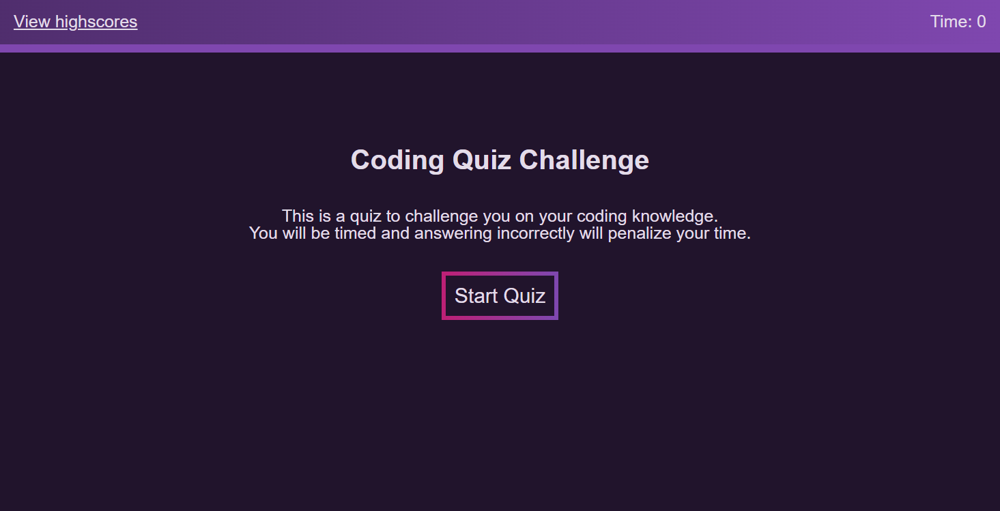

# Web-API-Code-Quiz

## Description

This is the 'Module 04' challenge assignment for the UCF coding bootcamp.

We were tasked with creating a quiz, giving us experience with traversing pages and working with localStorage.

## Installation

1. Copy the SSH URL
2. Open a terminal, navigate to the path where you want to open the code, and then enter into the terminal 'git clone [ssh url]'
3. ?
4. Profit

## Usage

You can install Visual Studio Code and get the 'Live Server' extension if you want to test it out in a web browser, otherwise you can just follow this [link](https://binnyboy1.github.io/Web-API-Code-Quiz/index.html).

- Clicking on 'Start' will start the quiz.
- Clicking on an answer will take you to the next question
- Clicking on a correct answer will display "Correct"
- Clicking on an incorrect answer will display "Incorrect" along with the correct answer, and your time will be penalized
- After going through all the questions, you will be able to save your initials to the scoreboard where the highscores are stored